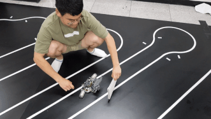
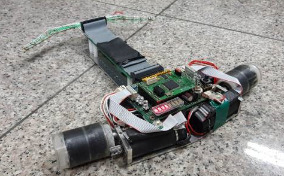
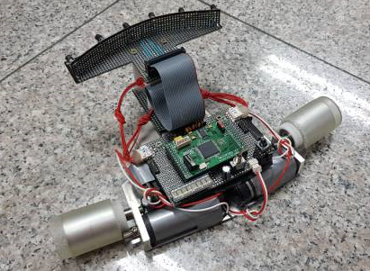

# Master & Slave Tracer

[단국대학교 MAZE](https://maze.co.kr) 개발내용

1차 개발 기간 : 2018. 06 ~ 2018. 08

2차 개발 기간 : 2019. 06 ~ 2019. 08

주관 : 충남대학교 메카트로닉스공학과
후원 : 산업통상자원부, 대전광역시교육청, 충남대학교

## 대회 개요

국가 발전의 원동력이 되는 공학도들에게 창의성을 고취시키고, 미래 지향적이며 전자, 기계, 컴퓨터 기술의 집약체인 로봇에 대한 흥미를 유발하여 미래의 유망한 엔지니어를 발굴 및 격려하고자 본대회를 개최합니다.

[대회 홈페이지](https://168.188.117.125/)

[대회 규칙](https://168.188.117.125/03_02.php)

## 대회 결과

[개발완료 보고서 PDF](./PDF/2018_마스터앤슬레이브_제작보고서.pdf)

[대회 영상 1](https://www.youtube.com/watch?v=HTpAFv1S_PA) ,  2018 제 7회 로봇융합 페스티벌 Master & Slave 부문 2위 [[PDF]](./PDF/2018_CIRO지능로봇대회_마스터슬레이브부문_2등.pdf)

[대회 영상 2](https://www.youtube.com/watch?v=eTKhToyow0Y) ,  2019 제 8회 로봇융합 페스티벌 Master & Slave 부문 3위 [[PDF]](./PDF/2019_CIRO지능로봇대회_마스터슬레이브부문_3등.pdf)

## 팀원 구성

|팀원|맡은 역할|
|:---------:|:---:|
|[이진호 (팀장)](https://github.com/StylishPanther)| 진행 과정 총괄, 하드웨어 제작, 추종 알고리즘 설계(정)|
|김혜원|추종 알고리즘 설계(부)| 

## 작품 목표    

1. 라인트레이서(Master)가 검은 바탕의 흰 색 선을 따라서 움직인다.
2. 슬레이브는 라인트레이서의 흰 색 원통을 보고 일정한 거리를 유지한 상태로 라인트레이서를 추종한다.
3. 라인트레이서와 슬레이브가 움직이는 도중 충돌하면 안 된다.

## 개발 내용 

  

 < 거리 유지 테스트 >
  

  

 < 직진 - 270도 - 직진 구간 추적 테스트 (Velocity : 1700mm/s)>

  

 < 직진 및 연속 270도(물방울 턴) 연속 구간 추적 테스트 (Velocity : 1700mm/s)>

  

 < 완주 테스트 (Velocity : 2000mm/s)>

 
 

 
  

 < 라인트레이서 (Master), 슬레이브 (Slave) >
  

## 작품 설명  

로봇이 2개여서 라인트레이서(Master)와 슬레이브(Slave)로 나뉘며 라인트레이서(Master)는 [링크](https://github.com/StylishPanther/LineTracer)에서 설명한다. 

즉, 하단의 내용은 모두 슬레이브의 개발 내용이다.

### 하드웨어 품목  

|Hardware Type|Model Name|Datasheet|  
|:---:|:---:|:---:|
|DSP|TMS320F2809PZA|[PDF](./PDF/tms320f2809pza.pdf)|  
|Infrared Sensor|SI-5312H, ST-1KLA|[PDF](SI-5312H.pdf), [PDF](./PDF/ST-1KLA.pdf)|  
|Motor|Maxon Motor RE-25 (118751)|[PDF](./EN-21-146.pdf)|    
|Motor Drive|LMT18200T|[PDF](./PDF/LMT18200T.pdf)|  
|Encoder|MR Encoder (225805)|[PDF](./PDF/EN-21-478.pdf)|
|Regulator|LM2576|[PDF](./PDF/LM2576_datasheet.pdf)|
|ROM|AT45DB011B-SI|[PDF](./PDF/AT45DB011B-SI.pdf)|

### 개발환경 

|Tool Name|Description|  
|:---:|:---:|  
|Source Insight|프로젝트 텍스트 에디터|

### SDK

|SDK|Description|  
|:---:|:---:|  
|IQmath Library| IQmath 제공|
|DSP280x|TMS320F280x Series Framework 제공|  
 

 ### Software 

크게 라이브러리를 이용한 펌웨어 설정 부분과 슬레이브 기능 구현을 위한 어플리케이션 부분으로 나뉘며 
Build.bat을 이용해 makefile을 동작시키는 방식으로 .hex파일을 생성했다.

 `DSP280x_***.c` : GPIO ,PWM, ADC, SCI, SPI, Clock, Timer 등의 기본 기능을 설정하는 파일로 Datasheet 기반으로 설정되었다. 
 Linker Script의 Peripherals 메모리 정보를 DSP280x_GlobalVariableDefs.c를 통해 불러와 주소를 지정해준다.
- - -

 ###  motor.c
`motor_ISR` : 500 마이크로초 마다 실행되는 타이머 인터럽트. Kp, Kd 계수에 의해 결정된 PWM 값으로 모터를 동작시키고 센서에 의해 결정되는 포지션에 따라서 좌회전, 우회전을 판단한다.

`Straight_PID()` : 포지션 값을 이용해 모터에 인가되는 PWM을 결정한다.
- - -
### sensor.c

ADC를 이용해 센서 값을 받기 위한 함수들로 구성되어있다.

`sen_vari_init()` : 센서와 관련된 변수들을 초기화 하는 함수.

`sensor_checking()` : VFD를 이용해서 로봇이 현재 받고있는 센서 값 출력

`make_position()` : 6개의 센서값과 6개 센서에 대한 포지션 테이블을 설정해 센서 값에 따른 위치 값을 결정. 위치 값이 0이 되도록 모터를 제어한다.

`position_enable()` : 포지션 값이 외란에 대해 강건성을 가지고 연속적으로 움직일 수 있도록 현재 보고 있는 위치에서 다음 값의 변화량이 너무 클 경우 무시한다. 

`maxmin_set()` : 적외선 센서의 최대 값과 최소 값을 127등분 해서 Threshold로 설정한 값 이상의 센서 값이 들어오면 그 곳을 추종 대상으로 생각한다. Threshold의 비율은 실험적으로 알아낸다.

`Handle()` : make_position()에 의해 결정된 포지션 값을 좌측 모터와 우측 모터의 PWM 인가 비율로 변환한다.

- - -
### Etc

`Rom.c` : SPI 통신을 이용해 이전에 저장해 놓은 각 센서 별 MaxValue, minvalue를 읽거나 저장한다.

`search.c` : 플래그를 통해 모터 타이머 인터럽트를 동작시킨다.

`menu.c` : 종합 디버깅 함수로 현재 상태의 센서 값, 포지션 값, 주행 결정 등을 선택 할 수 있게 함수 포인터로 구성되어있다.

 `variable.h` : 전역 변수로 설정된 변수들을 모아 놓은 헤더. 

 `struct.h` : 전역 변수로 설정된 구조체 변수들을 모아 놓은 헤더.

- - -
